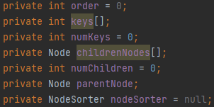

# B-tree 구현

# B-tree 란?

항상 균형을 유지하는 balanced tree의 한 종류이다. 일반적인 이진트리와 다르게 한 노드에 여러개의 키를 가질 수 있다는 점이 특징이다.

## 조건

M차 트리라고 할때, B-tree의 조건

1. 루트 노드를 제외한 모든 노드는 최대 $M$개 부터 최소 $⌈M/2⌉$개의 자식 노드를 가질 수 있다.
    1. 루트 노드는 최소 2개의 자식 노드를 가질 수 있다.
2. 루트 노드를 제외한 모든 노드는 최대 $M-1$개 부터 최소 $⌈M/2⌉-1$개의 키를 가질 수 있다.
    1. 루트 노드는 최소 1개의 키를 가질 수 있다.
3. 노드의 키가 $x$개라면, 자식 노드의 수는 $x+1$개 이다.
4. 모든 리프 노드는 동일한 레벨에 존재해야 한다.

# 구현

## 노드 구현하기

### 구조체에 필요한 정보

1. B-tree의 차수: 키를 추가할 때 2번 조건을 만족 하는지 검사하기 위해 필요하다.
2. 키를 저장할 공간: 키를 여러개 저장 가능한 특성 상 배열로 저장해야 한다.
3. 자식 노드를 저장할 공간: 자식도 여러 자식을 가질 수 있으므로 배열로 저장 해야 한다.
4. 부모 노드: 부모 노드를 저장해서 아래→위 방향으로 탐색이 가능하도록 해야한다.

### 선언 된 변수

1. order: 소속 된 B-tree의 차수
2. keys[]: 키를 저장할 배열
3. numKeys: 저장된 키의 개수
    - keys가 고정된 크기로 선언해야 하는 배열이라서, 임의의 값으로 채워서 배열 선언 후, 실제 값은 몇개가 추가되었는지 알기 위해 선언함.
4. childrenNodes[]: 자식 노드를 저장할 배열
5. numChildren: 저장된 자식 노드의 개수
    - 3번과 같은 이유로 선언
6. parentNode: 현재 노드의 부모 노드
7. nodeSorter: childrenNodes[]를 저장된 키의 오름차순으로 정렬하는 Comparator

### 생성자

- 파라미터
    - order: 소속된 B-tree의 차수
- least: 조건 2번의 $⌈M/2⌉-1$ 계산
- childrenNodes를 $order+least+1$개로 초기화.
    - 삭제 연산을 수행할 때 최소 개수 + 최대 개수의 노드 두 개가 병합될 경우를 생각하고 $order+least+1$개로 초기화 한다. 1개는 여유로 추가
- parentNode: 처음에는 null로 초기화.
    - root노드는 parentNode가 null.
- keys: childrenNodes와 같은 이유로 $order+least$개로 초기화.
- Arrays.fill: keys를 Integer의 최대 수로 초기화.

### 함수

getter와 setter는 생략

1. divideNode
    
    노드를 절반으로 나누는 함수. 노드 자신은 왼쪽 노드, 새로 생성하는 노드는 오른쪽 노드로 나누어진다.
    
    - 파라미터
        - int total: 키의 전체 개수
    
    
    
    키를 나누는 부분이다.
    
    1. total을 기준으로 중간 키 값을 기준 키로 지정
    2. 지정 키보다 위쪽에 있는 키들을 오른쪽 노드에 저장
    3. 왼쪽 노드에서는 삭제
    
    
    
    자식 노드를 나누는 부분이다.
    
    1. 자식 노드를 하나씩 가져옴
    2. 첫 번째 키 값이 기준 키 값보다 크다면, 오른쪽 노드에 자식 노드로 추가하고, 왼쪽 노드에서는 삭제
2. addKey
    
    노드에 키를 추가하는 함수.
    
    - 파라미터
        - int key: 추가할 키
    
    
    
    1. 추가할 키가 이미 존재하는지 검사. 존재한다면 false를 리턴하고 함수를 종료한다.
    2. keys에 키를 추가 후 정렬
    3. keys의 개수가 가질 수 있는 최대 개수보다 많다면 true 리턴, 아니라면 false 리턴
3. addChildNode
    
    자식 노드를 추가하는 함수
    
    - 파라미터
        - Node child: 추가할 자식 노드
    
    
    
    자식 노드를 추가하고, 정렬한다.
    
4. deleteKey
    
    대상 위치에 있는 키를 삭제하는 함수
    
    - 파라미터
        - int targetIdx: 삭제할 키 값이 존재하는 위치
    
    
    
    1. 키 값을 앞으로 한 칸씩 당겨옴.
    2. targetIdx부터 numkeys까지 반복
5. deleteChildNode
    
    대상 위치에 있는 자식 노드를 삭제하는 함수
    
    - 파라미터
        - int targetIdx: 삭제할 자식 노드가 존재하는 위치
    
    
    
    deleteKey와 원리가 같음.
    

# B-tree 구현하기

## 키 탐색 과정

1. 노드에 키 값이 존재하는지 확인
2. 키 값이 존재하지 않고, 중간 노드라면 다시 1번으로 돌아감
3. 키값이 존재하지 않고, 리프 노드라면 종료

## 키 탐색 구현

findNode 함수를 이용해 키를 탐색한다.

- 파라미터
    - int target: 탐색할 키

currentNode가 리프 노드일때까지 반복하며 키 값이 들어갈 수 있는 노드를 탐색하는 부분. 탐색 과정에서 키 값을 노드에서 찾으면 존재하는 노드와 몇 번째 키인지 리턴한다.

1. currentNode를 root로 지정
2. currentNode의 키 값을 하나씩 가져와 대상 키보다 큰지 검사.
    - i번째 키가 대상 키보다 크다 = i번째 자식 노드에 키 값이 존재해야 한다.
3. 2번을 만족하면 자식 노드를 currentNode로 지정하고, 2번부터 다시 반복
4. 만약 내부 노드에서 키 값이 발견된다면, 발견된 노드와 몇 번째 키인지 리턴.
5. 만약 키 값이 존재할 수 있는 자식 노드를 찾지 못했다면, 가장 마지막 자식 노드를 currentNode로 지정
    - 키는 i개 지만, 자식 노드는 항상 i+1개 이므로 i번째 자식 노드까지 대상 키 값이 존재할 수 있는 노드가 아니라면, i+1번째 노드는 반드시 존재할 수 있는 노드이다.

대상 키가 존재 가능한 자식 노드에 키 값이 이미 존재하는지 검사하는 부분. 있다면 키가 존재하는 부분과 위치를 리턴, 없다면 키를 추가할 수 있는 노드를 리턴.

1. 키를 앞부터 차례대로 가져옴
2. 대상 키 값과 정확히 같다면 발견된 노드와 몇 번째 키인지 리턴.
3. 마지막 키까지 1번부터 반복
4. 대상 키 값이 존재하지 않는다면, 대상 키 값을 추가할 수 있는 노드를 리턴

## 노드 추가 과정

1. 리프 노드에 키 추가
2. 키 개수가 조건 2를 만족하지 않는다면, 노드를 분할하고 부모 노드에 분할된 노드의 중간 키 값을 추가
3. 조건 2를 만족한다면, 함수 종료
4. 조건 2를 만족할때까지 2번부터 반복.

## 키 추가 구현

insertNode함수로 키를 추가한다.

- 파라미터
    - int newData: 추가할 키 값

추가할 키 값이 존재하는지 찾고, 이미 존재한다면 함수 종료, 아니라면 추가할 노드를 가져오는 부분.

1. root 노드가 null 이라면 = B-tree가 비었다면
    - root 노드를 만들고 키를 추가하고 함수 종료
2. findNode함수를 이용해 키 값이 이미 존재하는지 검사
3. 키가 존재하지 않는다면 currentNode를 추가 가능한 노드로 지정
4. 이미 존재한다면 키 중복 방지를 위해 함수 종료

노드에 키를 추가하고, 키의 개수가 최대 개수 이상이라서 조건 2를 만족하지 않느다면, 노드를 분할하는 부분. 리프 노드부터 시작해서 한 레벨씩 올라가도록 bottom-up 방식으로 구현했다.

1. addKey를 이용해서 값을 추가.
2. addkey의 리턴값이 true라면 = 노드의 키 개수가 최대 개수 초과라면
3. keys의 중간 idx 값을 divideIdx에 저장
4. 현재 노드의 부모 노드가 존재한다면, 부모 노드에 keys의 중간 값을 추가
5. 아니라면 새 부모 노드를 만들어 새 부모 노드에 keys의 중간 값 추가
6. divideNode 함수를 이용해 함수 분할 (노드 분할)
7. 분할된 오른쪽 노드의 부모 노드 지정. 부모 노드도 자식 노드로 오른쪽 노드 추가
8. currentNode가 root 노드와 같다면 부모 노드를  root로 지정 (높이 증가)
9. 현재 노드의 키 개수가 최대 개수보다 작을때 까지 3번부터 반복 (분할 재귀)
10. addkey리턴값이 false라면 = 노드 키 개수가 최대 개수 이하라면, 함수 종료 (기본 삽입)

## 키 삭제 구현

키를 삭제해도 B-tree의 균형을 깨뜨리지 않도록 만드는것이 관건이다.

## 키 삭제 과정

크게 세 가지 케이스로 나눈다.

1. 삭제할 키가 리프 노드에 있는 경우
2. 삭제할 키가 내부 노드에 있고, 자기 자신이나 자식 노드의 키가 최소 개수보다 많을 경우
3. 삭제할 키가 내부 노드에 있고, 자기 자신과 자식노드의 키가 최소 개수만 있을경우

---

각 케이스의 세부 케이스는 다음과 같다.

**case1. 삭제할 키가 리프 노드에 있는 경우**

1. 삭제할 키가 있는 노드가 root 노드라면
    1. 키 삭제
2. 현재 노드의 키 개수가 최소보다 많다면
    1. 키 삭제
3. 왼쪽 형제 노드가 존재하고, 노드의 키 개수가 최소보다 많다면
    1. 현재 노드에서 키 삭제
    2. 현재 노드의 부모 키를 현재 노드로 이동
    3. 왼쪽 노드에서 가장 큰 키를 부모 노드로 이동
4. 오른쪽 형제 노드가 존재하고, 노드의 키 개수가 최소보다 많다면
    1. 현재 노드에서 키 삭제
    2. 현재 노드의 부모 키를 현재 노드로 이동
    3. 오른쪽 노드에서 가장 작은 키를 부모 노드로 이동
5. 부모 노드의 키 개수가 최소보다 많다면
    1. 부모 노드의 키를 형재 노드로 이동
    2. 부모 노드의 키를 추가한 형재 노드와 현재 노드 병합
6. 1~4를 전부 만족하지 않는다면
    1. 5번의 과정을 수행
    2. case 3의 2번으로 이동

**case2. 삭제할 키가 내부 노드에 있고, 자기 자신이나 자식 노드의 키가 최소 개수보다 많을 경우**

1. 자식이 리프 노드인 경우
    1. 왼쪽 자식의 키 개수가 최소보다 크다면
        1. 대상 키 삭제
        2. 왼쪽 자식 노드에서 가장 큰 값을 현재 노드로 이동
    2. 오른쪽 자식의 키 개수가 최소보다 크다면
        1. 대상 키 삭제
        2. 오른쪽 자식 노드에서 가장 작은 값을 현재 노드로 이동
    3. 현재 자식의 키 개수가 최소보다 크다면
        1. 대상 키 삭제
        2. 왼쪽 자식과 오른쪽 자식을 병합
    4. a~c를 모두 만족하지 않는다면
        1. case 3으로 이동
2. 자식이 리프 노드가 아닌경우
    1. 왼쪽 자식 노드중 가장 큰 값과 현재 키의 자리를 바꿈
    2. 리프 노드로 이동한 현재 키를 삭제
    3. case 1로 이동

**case3. 삭제할 키가 내부 노드에 있고, 자기 자신과 자식노드의 키가 최소 개수만 있을경우**

1. 대상 키를 삭제하고, 왼쪽/오른쪽 자식 노드를 병합
2. 현재 노드와 현재 노드의 형제 노드, 현재 노드의 부모 키를 병합하고, 병합된 노드를 현재 노드로 지정
3. 2번에서 병합된 현재 노드의 키 개수가 최대 개수 초과라면
    1. 현재 노드를 다시 좌우 노드로 분할
4. 2번에서 병합된 현재 노드의 부모 노드가 키를 최소 개수 미만으로 가지고 있다면
    1. 2번부터 재귀적으로 다시 실행

## 각 케이스별 실제 구현

### 공통적인 함수

deleteNode 함수로 크게 어떤 케이스에 해당되는 삭제 과정인지 판단하고, 적절한 함수를 실행시키는 함수이다.

- 파라미터
    - int target: 삭제할 키

케이스가 크게 삭제할 키가 리프 노드에 있는지와 없는지로 나뉘므로, 삭제할 키가 리프 노드인지 검사하고 리프 노드라면 case1 함수를, 아니라면 case2 함수 실행.

### **case1. 삭제할 키가 리프 노드에 있는 경우**

deleteLeafNodeKey 함수로 case1의 경우를 처리.

- 파라미터
    - Node currentNode: 삭제할 키가 있는 현재 노드
    - int targetIdx: currentNode에서 삭제할 키의 keys 배열에서 위치
    - int leastKeyNum: 노드가 가지고 있어야 할 최소 키 개수 + 1

case1.1을 처리하는 부분

1. 현재 노드가 루트라면
2. 루트 노드는 키를 최소 1개까지 보유 가능하므로 바로 삭제. (기본 삭제)
3. 삭제 후 키 개수가 0개라면 B-tree를 빈 트리로 처리

case1.2를 처리하는 부분.

1. 현재 노드의 키 개수가 최소보다 많다면
2. 키 삭제. (기본 삭제)

case1.3를 처리하는 부분. (형제 노드 빌리기)

1. 현재 노드의 위치가 0보다 크고(=형제 노드가 왼쪽에 존재하고), 왼쪽 형제 노드의 키 개수가 최소보다 많다면
2. 왼쪽 형제 노드를 가져와 leftNode에 저장
3. 왼쪽 형제 노드의 가장 큰 값을 maxKey에 저장
4. 현재 노드에서 삭제 대상 키 삭제
5. 현재 노드의 부모 키를 현재 노드에 추가. 이때 부모 키는 부모 노드의 키를 오른쪽애서 왼쪽으로 탐색할 때, 현재 노드의 키보다 작은 키 중 가장 첫 키이다.
6. 현재 노드에 추가한 키는 부모 노드에서 삭제
7. 부모 노드에 왼쪽 형제 노드의 가장 큰 값 추가

case1.4를 처리하는 부분. case1.3의 처리 과정에서 왼쪽 형제 노드가 오른쪽 형제 노드로, 가장 큰 값이 가장 작은 값으로 바꾸어 생각하면 된다. (형제 노드 빌리기)

case 1.5를 처리하는 부분. (노드 병합)

1. 부모 노드가 키를 빌려올 여유가 될 때
2. 왼쪽과 오른쪽 형제 노드중 존재하는 형제 노드를 siblingNode에 저장
3. 형제 노드에 부모 노드의 대상 키 값을 가져와 추가하고, 부모 노드에서는 삭제
4. 현재 노드에서 삭제할 값을 삭제
5. 형재 노드와 현재 노드를 병합 후 mergedNode에 저장
6. 부모 노드에서 병합 전 두 노드를 자식에서 삭제하고, mergedNode를 부모 노드에 자식 노드로 추가
7. mergedNode의 부모를 병합 전 현재 노드의 부모 노드로 지정

case1.6을 처리하는 부분. case1.5를 처리하고, 부모 노드의 상황에 따라 다음 함수 실행을 결정한다.

1. case1.5와 같은 과정 처리. (노드 병합)
2. 부모 노드가 root인 동시에 키 개수가 0개라면, 기존 root 노드를 삭제하고 현재 노드를 root 노드로 지정 (높이 감소)
3. 아니라면 case3으로 이동

### **case2. 삭제할 키가 내부 노드에 있고, 자기 자신이나 자식 노드의 키가 최소 개수보다 많을 경우**

1. deleteInternalNodeLeastUp로 case2의 경우를 처리
    - 파라미터
        - Node currentNode: 삭제할 키가 있는 현재 노드
        - int targetIdx: currentNode에서 삭제할 키의 keys 배열에서 위치
        - int leastKeyNum: 노드가 가지고 있어야 할 최소 키 개수 + 1
    
    
    
    case 2를 처리하는 부분.
    
    1. 현재 노드의 자식 노드가 리프 노드가 맞다면
        1. 왼쪽 자식 노드가 키를 최소 개수보다 많이 가지고 있다면 (형제 노드 빌리기)
            1. 현재 자식 노드에서 키 삭제
            2. 왼쪽 자식 노드의 가장 큰 키 값 저장하고, 왼쪽 자식 노드에서는 삭제
            3. 현재 노드에 왼쪽 자식 노드에서 가장 큰 값을 추가
        2. 오른쪽 자식 노드가 키를 최소 개수보다 많이 가지고 있다면 (형제 노드 빌리기)
            1. 현재 자식 노드에서 키 삭제
            2. 오른쪽 자식 노드의 가장 작은 키 값 저장하고, 오른쪽 자식 노드에서는 삭제
            3. 현재 노드에 오른쪽 자식 노드에서 가장 작은 값을 추가
        3. 현재 노드의 키 개수가 최소보다 크다면 (노드 병합)
            1. 현재 자식 노드에서 키 삭제
            2. 왼쪽 자식과 오른쪽 자식 병합 후, 병합된 노드의 현재 노드를 부모 노드로 지정
        4. 현재 노드 자신과 바로 아래 레벨의 모든 자식 노드의 키 개수가 최소 이하라면
            1. 현재 노드가 root면서 키 개수가 0개보다 많다면 deleteWithSawpKey 함수로 case 2.2 처리 (자식 노드 빌리기)
            2. 아니라면 case 3으로 이동
    2. 현재 노드의 자식 노드가 리프 노드가 아니라면
        1. deleteWithSawpKey 함수로 case 2.2 처리 (자식 노드 빌리기)

1. deleteWithSawpKey로 case 2.2의 경우 처리. (자식 노드 빌리기)
    - 파라미터
        - Node curretNode: 삭제할 키가 있는 현재 노드
        - Node childNode: 현재 노드의 왼쪽 자식 노드
        - int leastKeyNum: 노드가 가져야할 최소 키 개수 + 1
        - int targetIdx: currentNode에서 삭제할 키의 idx
    
    
    
    삭제해야할 키 값을 리프 노드의 키 값과 교환하며 case 1로 만들어 처리.
    
    1. childNode의 맨 오른쪽 노드를 리프 노드가 나올때까지 가져옴. B-tree에 존재하는 삭제할 키보다 작은 키중 가장 큰 값을 가져오기 위함.
    2. 삭제할 키 값과 1번에서 구한 키 값을 위치 교환함
    3. deleteLeafNodeKey 함수로 이동하여 case 1로 처리

### **case3. 삭제할 키가 내부 노드에 있고, 자기 자신과 자식노드의 키가 최소 개수만 있을경우**

deleteInternalNodeLeastDown으로 case 3의 경우 처리

- 파라미터
    - Node currentNode: 현재 노드
    - int targetIdx: 삭제할 키의 idx. 만약 값이 -1이라면, 키 삭제 부분은 건너 뛰고 노드 병합으로 바로 넘어감
    - int leastKeyNum: 노드가 가져야 할 최소 키 개수 +1
    
    
    

현재 노드에서 키를 삭제하고 두 자식 노드를 병합하는 부분. 이 부분을 건너뛰게 만든 이유는 바로 case3.2로 넘어오는 case1.6 때문이다.

1. 현재 노드에서 대상 키 삭제
2. 현재 노드의 좌/우 자식 노드들을 하나로 병합. (노드 병합)
3. 병합된 노드를 새 자식 노드로 추가

현재 노드가 root 노드라면, 병합하고 하나밖에 없는 자식 노드를 가져와 root 노드로 지정. (높이 감소)

현재 노드와 형제 노드를 결합하여 하나의 노드를 만드는 부분. (노드 병합)

1. 좌/우 형제 노드 중 존재하는 형제 노드를 가져옴
2. 가져온 형제 노드에 부모 키 값 넣고, 부모 노드에서는 삭제
3. 현재 노드와 형제 노드를 병합하고, 부모 노드에 추가.

노드를 병합하고 난 뒤에 상태를 보며 적절한 단계로 넘어가게 해주는 부분.

1. 병합된 노드가 가질 수 있는 최대 키 개수보다 많이 가지고 있다면
    1. 병합된 노드를 중간 idx를 기준으로 나누고 나누어진 두 노드를 다시 부모 노드에 추가
2. 부모 노드가 root 노드가 아니면서 부모 노드의 키 값이 최소 값보다 작다면
    1. case 3.2로 바로 이동. deleteInternalNodeLeastDown을 실행하며 targetIdx값을 -1로 넘겨준다.  (병합 재귀)
3. 부모 노드가 root 노드면서 비었다면
    1. 병합된 노드를 새 root 노드로 지정  (높이 감소)